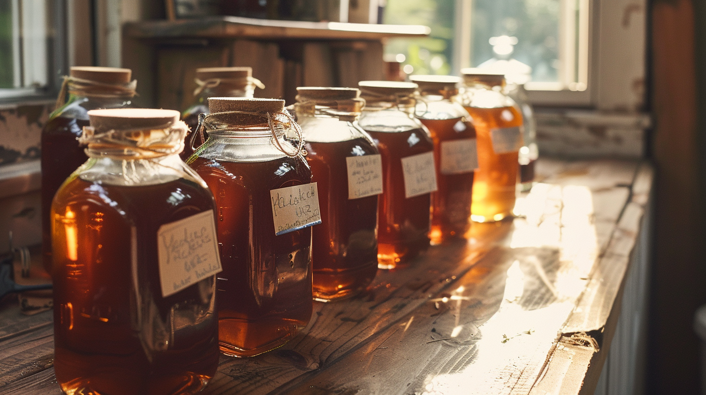
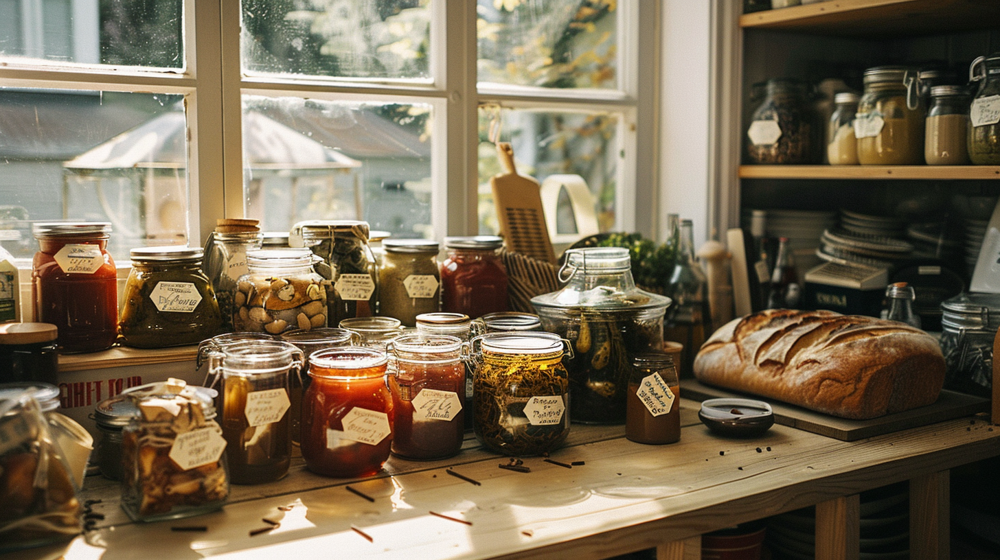

# Alaska Just Made It Easier Than Ever to Sell Your Homemade Food. Here's What That Means for Fairbanks Neighbors.

*By Bernard, founder of Tleten*

---

Last spring I made a batch of birch syrup. It was good — genuinely good — and I had more than I could ever use. What I wanted was simple: to give some away, maybe trade a bottle for a neighbor's sourdough, sell a few to cover the cost of tapping and boiling. What I didn't want was to wade through permits, inspections, and commercial kitchen requirements just to share food with my neighborhood.

Turns out, in Alaska, I didn't have to.

Alaska has some of the most neighbor-friendly homemade food laws in the country — and they just got significantly better. If you've been making jam, baking bread, fermenting, or growing more than you can eat, here's what you need to know.

---

## What Alaska's Homemade Food Law Actually Allows

In August 2024, Governor Dunleavy signed **HB 251** into law, replacing the old cottage food rules with something Alaskans had been asking for: a genuine food freedom law.

Here's what changed and what it means in plain terms:

**No permit or inspection required.** You don't need a state inspection to sell food made in your home kitchen. Your kitchen just needs to be yours (owned or leased) and functional — sink, stove, fridge.

**No sales cap.** The old law capped annual sales at $25,000. That limit is gone. If your neighbor's sourdough habit turns into something real, the law won't stop you.

**Refrigerated foods are now allowed.** This is the big one. Under the old rules, you could sell a plain sourdough loaf but not one topped with cream cheese. You could sell dry jam but the rules got complicated fast. Now Alaska explicitly allows the sale of most foods that require refrigeration — things like cheesecake, fresh juice, prepared meals, and cream-filled pastries. These are foods that most other states still prohibit under cottage food laws.

**You can sell online and at markets.** Non-perishable homemade foods can be sold online (within Alaska), at farmers markets, from your home, at roadside stands, and at events. Perishable foods have to be sold directly by you to the consumer.

**You do need a business license.** This is the one formal requirement — a standard Alaska business license. It's not complicated, but it's not optional either.

**Labeling is required.** Any packaged food needs a label with your name, address, phone number, business license number, and a statement that it was made in a home kitchen and is not state-inspected.

---

## What You Can't Sell

There are some clear lines in Alaska's law worth knowing:

- **Game meat** — moose, caribou, and other wild-harvested game cannot be sold under homemade food rules. This is a hard stop, and it's separate from the spirit of what these laws are trying to enable.
- **Uninspected seafood or shellfish**
- **Raw or unpasteurized milk products**
- **Foods containing alcohol or cannabis**
- **Oils rendered from animal fat**

If you're in **Anchorage specifically**, note that the Municipality has its own rules that can differ from the state law. Check with the Anchorage Health Department before selling.

---

## Why This Matters in Fairbanks

I've lived here long enough to know that Fairbanks has always had its own food economy running quietly in the background. Jars passed over fences. Extra garden rhubarb traded for pickled garlic. A neighbor who makes the best birch syrup you've ever tasted but has no way to sell it officially.

That informal economy exists everywhere, but it's especially meaningful in Interior Alaska — where growing seasons are short and intense, where people put food by out of genuine necessity, where the cost of groceries at the end of a long winter is real, and where the skills of fermentation, preservation, and scratch cooking are passed down and valued.

HB 251 didn't create that culture. It just finally gave it legal room to breathe.

For someone growing more tomatoes than they can eat in August, or fermenting more sauerkraut than their family needs, or making jam from berries they picked themselves — this law says: you can share this with your neighbors, and you can ask for fair value for your time and skill. That's not radical. That's just community.

---

## That's Why I Built Tleten

I built Tleten because the informal food economy in Fairbanks deserved a place to exist more openly.

Tleten is a free iOS app that lets Fairbanks neighbors list, trade, swap, and sell homemade and home-grown food — jams, baked goods, garden surplus, ferments, recipes, whatever your kitchen produces. Every listing includes an attestation that the food meets Alaska's homemade food guidelines. The platform is built around compliance, not around ignoring it.

It's not a food business. It's a neighborhood technology platform — one that believes your blueberry jam, your sourdough starter, your pickled everything, and your grandmother's pierogi recipe deserve to find people who appreciate them.

If you're a cottage food maker in Fairbanks — or you want to be — Tleten is where to start.

**[Download Tleten on the App Store →](https://apps.apple.com/us/app/tleten/id6761312133)**

---

## A Few Practical Notes Before You Start Selling

If you're ready to start selling homemade food in Alaska, here's a short checklist:

1. **Get an Alaska business license** — apply at the state's Division of Corporations website
2. **Know your food type** — is it perishable (needs refrigeration) or shelf-stable? The answer affects where and how you can sell it
3. **Label everything** — name, address, phone, business license number, and the required statement
4. **Check local rules** — especially if you're in Anchorage
5. **When in doubt, test** — the Alaska State Environmental Health Laboratory can test pH and water activity for $10–$20 per sample if you're uncertain whether your product is potentially hazardous

The UAF Cooperative Extension Service also runs workshops and consults with homemade food producers across Alaska — they're an excellent resource if you want guidance beyond what's written here.

---

*This post is for informational purposes only and does not constitute legal advice. Laws change; always verify current requirements with the Alaska Department of Environmental Conservation or a qualified attorney before selling homemade food.*

*Tleten is an iOS app connecting Fairbanks neighbors through homemade food. [Download it free on the App Store.](https://apps.apple.com/us/app/tleten/id6761312133)*